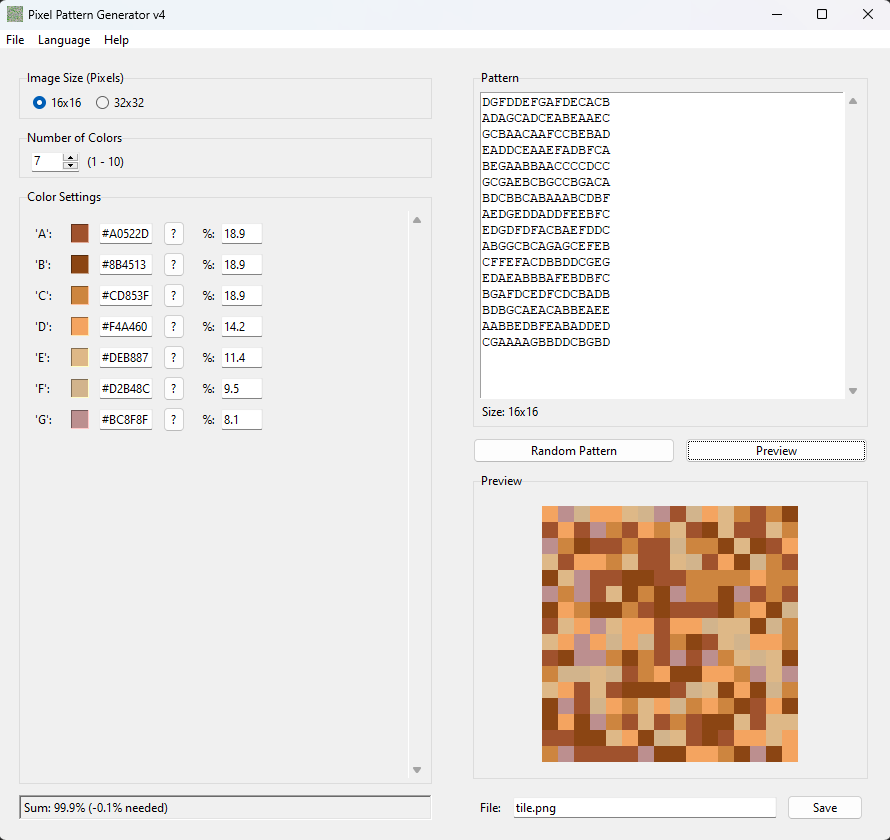

# Pixel Pattern Generator

A graphical user interface (GUI) tool built with Python and Tkinter to create, visualize, and generate pixel art patterns based on user-defined colors and distributions.


*(Please replace this line above with an actual screenshot named overview.png in the repository root)*

## Features

*   **Graphical User Interface:** Easy-to-use interface built with Tkinter.
*   **Selectable Canvas Size:** Choose between 16x16 or 32x32 pixel grids.
*   **Variable Number of Colors:** Define 1 to 10 different colors for your pattern.
*   **Custom Color Input:**
    *   Enter colors using standard Hex codes (e.g., `#FF0000`).
    *   Use the integrated color picker to select colors visually.
    *   Color preview boxes for quick reference.
*   **Manual Pattern Input:** Draw your pattern directly using assigned characters (A, B, C...) in a text area.
*   **Random Pattern Generation:**
    *   Generate random patterns based on specified color percentages.
    *   Calculates and displays the current percentage sum, indicating if adjustment is needed.
    *   Option to normalize percentages if they don't add up to 100%.
*   **Live Preview:** See a scaled preview of your pattern update as you make changes. Uses nearest-neighbor scaling for crisp pixel art.
*   **Save Functionality:** Save the generated pattern as a PNG image file.
*   **Multilingual Support:** Switch the UI language between English and German via the menu.
*   **Cross-Platform:** Should run on Windows, macOS, and Linux if Python and dependencies are installed.

## Requirements

*   **Python 3.x** (Developed and tested with Python 3.13, but should work on most Python 3 versions)
*   **Tkinter:** Usually included with standard Python installations. Make sure Tcl/Tk support was enabled during Python installation (this is the default).
*   **Pillow:** The Python Imaging Library fork, used for image handling and the preview.

    ```bash
    pip install Pillow
    ```

## How to Run

1.  **Clone the repository:**
    ```bash
    git clone https://github.com/Iam-Sanja/Pixel-Pattern-Generator.git
    cd Pixel-Pattern-Generator
    ```

2.  **(Recommended) Create and activate a virtual environment:**
    ```bash
    # Windows
    python -m venv venv
    .\venv\Scripts\activate

    # macOS / Linux
    python3 -m venv venv
    source venv/bin/activate
    ```

3.  **Install dependencies:**
    ```bash
    pip install Pillow
    # or if requirements.txt is created:
    # pip install -r requirements.txt
    ```

4.  **Run the application:**
    ```bash
    python pattern_to_image.py
    ```
    *(Note: The script is currently named `pattern_to_image.py`. You might want to rename it to something like `pixel_generator_app.py`)*

## Usage Tips

*   **Color Characters:** The first color you define corresponds to 'A', the second to 'B', and so on, according to the `COLOR_CHARS` constant in the script.
*   **Manual Pattern:** Ensure your manually entered pattern matches the selected grid size (e.g., 16 lines of 16 characters for 16x16). Use only the allowed characters ('A', 'B', ... corresponding to your defined colors).
*   **Random Percentages:** Make sure the percentages add up to roughly 100% for predictable random generation. The tool will warn you and offer to normalize if the sum is off.
*   **Saving:** If no file extension is provided, `.png` will be added automatically.

## Future Ideas (Optional)

*   Load/Save pattern definitions (colors, percentages, text pattern).
*   More sophisticated random generation algorithms (e.g., noise, cellular automata).
*   Basic drawing tools directly on the preview.
*   Support for transparency (alpha channel).

---

*Feel free to contribute or report issues!*